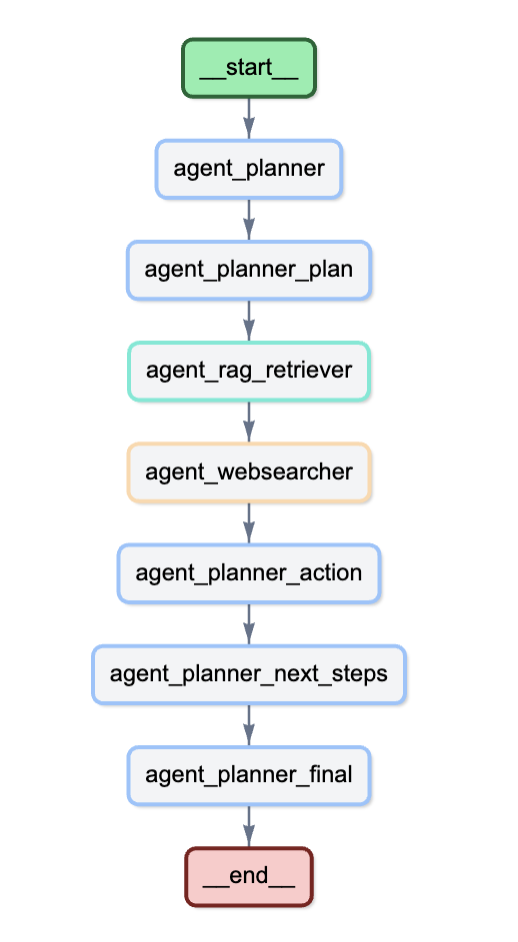
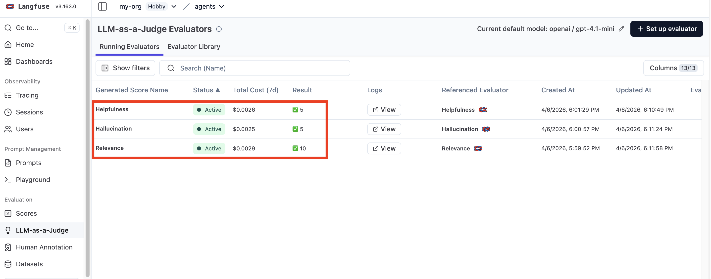
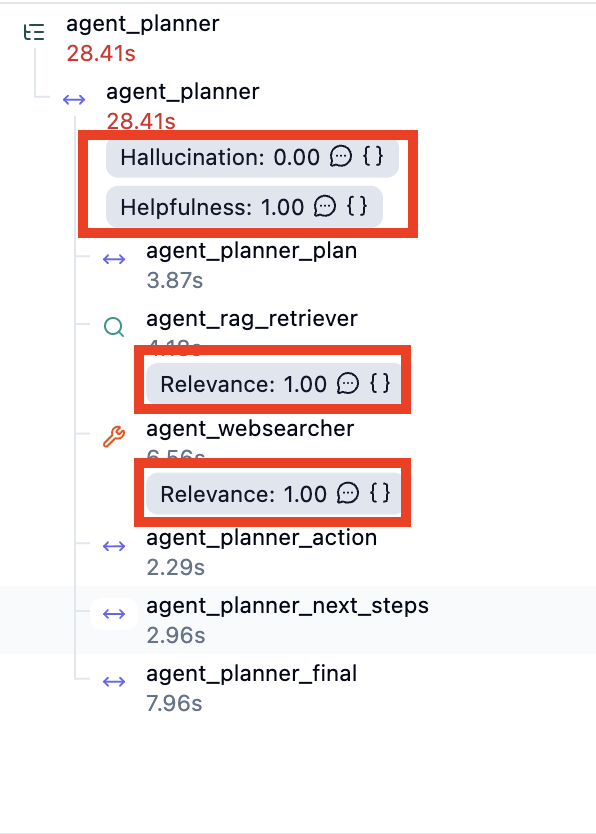

# Three-Agent CLI (Planner + RAG + Web)

A minimal terminal-first agent workflow for complaint triage, combining planning, RAG retrieval, and web evidence collection.

## Overview



This repository implements a simple three-agent system for Booking.com-like customer issues.

- **Agent-1 Planner** creates a structured plan from a user goal.
- **Agent-2 RAG Retriever** fetches internal policy evidence from a Milvus Lite vector store.
- **Agent-3 Websearcher** gathers public evidence from Booking.com pages using SerpAPI or BeautifulSoup.

The system is designed for live CLI execution with real-time plan/log updates and a separate RAG build/evaluation flow.

## What it does

- Generates a TODO-style plan from a customer goal.
- Executes tasks sequentially through a planner-driven loop.
- Uses real tools: Milvus Lite vector retrieval and web scraping / search.
- Summarizes retrieved evidence and generates a final user-facing triage response.

## Key Capabilities

- **Planning:** `PlannerAgent.plan()` generates a structured JSON plan with:
  - `rag_query`
  - `web_keywords`
  - `tool_choice`
  - `tasks` list with fixed IDs `rag`, `web`, `action`, `next_steps`, `result`
- **Execution loop:** `ThreeAgentSystem.run()` iterates tasks sequentially, updating task status and emitting events.
- **Tool use:** External tool use includes:
  - Milvus Lite / vector retrieval for internal RAG evidence
  - BeautifulSoup scraping of public URLs
  - Optional SerpAPI search when configured
- **Context strategy:** The system avoids prompt overflow by:
  - extracting concise `web_keywords` instead of sending full text
  - retrieving only top-k evidence chunks from RAG
  - summarizing evidence before using it in later planner prompts
  - building the vector store separately with `run_milvius.py`

## Project Structure

```
.
├── agent_system/          # Core agents and utilities
│   ├── __init__.py
│   ├── agents.py          # Agent-1/2/3 implementations
│   ├── config.py          # AppConfig (env, providers, settings)
│   ├── model_provider.py  # OpenAI/Gemini abstraction layer
│   ├── models.py          # RunRequest, RunResult, Task, Evidence
│   ├── rag_store.py       # Milvus Lite RAG build/retrieve
│   ├── system.py          # ThreeAgentSystem execution loop
│   ├── tracer.py          # Langfuse tracing integration
│   └── utils.py           # Text/keyword helpers
├── data/
│   ├── rag/               # Internal policy documents
│   │   ├── escalation_matrix.md
│   │   ├── payment_disputes.md
│   │   ├── privacy_requests.md
│   │   └── refunds_policy.md
│   └── rag_eval.py        # Retrieval evaluation queries
├── log/                   # Run outputs (JSON/TXT)
├── vector_db/             # Milvus Lite database artifacts
├── main.py                # CLI runner
├── run_milvius.py         # Build/reuse/evaluate RAG data
├── requirements.txt       # Python dependencies
└── README.md
```

## Setup

1. Install dependencies:

```bash
pip install -r requirements.txt
```

2. Copy environment variables:

```bash
cp .env.example .env
```

3. Build or reuse the RAG index:

```bash
python run_milvius.py
```

4. Run the CLI workflow:

```bash
python main.py --goal "customer is escalating for refund that is not being booked"
```

## CLI Usage

Run interactively:

```bash
python main.py
```

Available options:

```bash
--goal             High-level complaint or support/legal question.
--case-context     Optional extra context.
--provider         LLM provider: openai or gemini.
--embedding-provider Embedding provider: openai or gemini.
--public-url       One or more public URLs for web evidence.
--json             Print full JSON output.
```

## Provider Switching

OpenAI:

```bash
python run_milvius.py --embedding-provider openai
python main.py --provider openai --embedding-provider openai --goal "guest cancelled but was still charged"
```

Gemini:

```bash
python run_milvius.py --embedding-provider gemini
python main.py --provider gemini --embedding-provider gemini --goal "guest cancelled but was still charged"
```

## RAG Build and Evaluation

- `run_milvius.py` builds or reuses the Milvus Lite index from `data/rag/`.
- Documents are chunked into ~700-character windows with sentence overlap.
- Embeddings are stored and retrieved with cosine similarity.
- Evaluation uses `data/rag_eval.py` to measure hit rate and MRR on sample queries.

Example evaluation cases:
- customer cancelled inside free cancellation window but was still charged
- property marked booking as no-show after guest says they cancelled
- chargeback dispute for duplicate property charge
- customer requests deletion of personal data

## Internal Architecture

### Planner

`agent_system/agents.py` defines `PlannerAgent`, which:
- creates a fallback plan from the goal and context
- normalizes model output into exactly five tasks
- generates action plan, next steps, and final answer using evidence summaries

### RAG Retriever

`RagRetrieverAgent` retrieves internal policy evidence and summarizes it with the LLM.

### Web Searcher

`WebSearcherAgent` collects public evidence from Booking.com via:
- `SerpAPI` when configured
- `BeautifulSoup` scraping otherwise

Evidence is ranked by keyword overlap and distilled into summary bullets.

## Context Management

This repository avoids prompt overflow by:
- generating `web_keywords` instead of full page text
- retrieving only top-k evidence chunks
- summarizing evidence before feeding it back into planner prompts
- keeping each task prompt focused on a single responsibility

## Notes

- No heavy agent framework is used; the implementation is simple Python orchestration.
- The RAG builder is separate from the live runtime.
- SerpAPI is optional — fallback is BeautifulSoup scraping of provided public URLs.
- `log/` stores output artifacts per run.

## Evaluation Setup




Used Langfuse LLM-as-a-Judge evaluators to measure the quality of agent outputs at different stages of execution.
This helps us validate not only the final response, but also the intermediate steps such as planning, retrieval, and web search.

### Evaluators Used

**Helpfulness**  
Measures whether the generated response is useful, clear, and aligned with the user’s request.  
A higher score indicates that the response is actionable and answers the task effectively.

**Hallucination**  
Measures whether the response contains unsupported, fabricated, or misleading information.  
A lower score is better here, since it indicates the model stayed grounded and avoided making things up.

**Relevance**  
Measures whether the retrieved or generated content is relevant to the current task or query.  
A higher score indicates that the agent is selecting information that is closely related to the user’s intent.

### How the Evaluation Is Applied

The evaluators are attached to different parts of the agent trace:

- Planner output is checked for Helpfulness and Hallucination
- Retriever results are checked for Relevance
- Web search results are also checked for Relevance

This lets us evaluate the system at a component level instead of only judging the final answer.  
For example:

A high helpfulness score means the planner is producing useful next steps  
A low hallucination score means the planner output is grounded  
A high relevance score means the retriever and web searcher are fetching useful supporting information

### Why This Matters

By evaluating each stage independently, we can identify where the pipeline performs well and where it needs improvement.  
This makes debugging easier and provides a more reliable way to improve overall agent quality.

**Typical benefits of this setup:**
- Detect unhelpful planning steps early
- Catch hallucinated content before it reaches the final answer
- Verify that retrieval and search components are returning contextually relevant information
- Improve trust and consistency in the end-to-end agent workflow

### Example Interpretation

A trace with:

- Helpfulness: 1.00
- Hallucination: 0.00
- Relevance: 1.00

can be interpreted as:

- the planner produced a useful response,
- the output did not contain unsupported information,
- and the retrieved/search results were relevant to the task.

## Design Tradeoffs

### Trade-offs Made
- **CLI over UI:** Focused on a terminal-first interface to keep the scope small and demonstrate the core agent loop without adding frontend complexity.
- **Fixed Task Structure:** Used a rigid 5-task pipeline (rag, web, action, next_steps, result) instead of dynamic planning to simplify the execution loop and ensure reliability.
- **Custom Orchestration:** Built everything from scratch without agent frameworks like LangChain or AutoGen, which increased development time but provided full control and understanding of the system.
- **Correctness over Features:** Prioritized a working, correct implementation over extras like persistence or multi-turn conversations to meet the core requirements within the time frame.

## What I Could Improve or Extend

- **Minimal UI/Dashboard:** Add a simple web interface using Flask or Streamlit to visualize task progress and allow interactive task management.
- **Persistence and Resume:** Implement session state storage (e.g., in JSON or database) to allow resuming interrupted runs or handling multi-turn conversations.
- **Expanded Tool Set:** Integrate additional tools like API calls to external services, document editing capabilities, or more search sources beyond Booking.com.
- **Dynamic Planning:** Make the planner generate a variable number of tasks based on goal complexity, rather than the fixed 5-task structure.
- **Multi-turn Support:** Extend the system to handle follow-up questions and maintain conversation context across multiple interactions.
- **Enhanced Evaluation:** Add more automated tests, user feedback loops, and metrics like response time, accuracy on benchmark datasets, and user satisfaction surveys.


## Example Transcript

Below is a real session transcript from running the agent on a customer complaint about a no-show marking after cancellation.
"PENDING": "[ ]", "IN_PROGRESS": "[~]", "DONE": "[x]"

**User Goal:** A property marked a reservation as a no-show after the guest claims they cancelled the booking.

**Generated Plan:**
- [x] Retrieve relevant documents and policies on Booking.com no-show and cancellation disputes
- [x] Search for recent cases and guidelines on Booking.com no-show complaints and guest cancellation claims
- [x] Analyze gathered information to identify steps for complaint triage and resolution
- [~] Outline actionable next steps for complaint handling and communication with property and guest
- [ ] Compile a summary report of findings and recommended complaint triage actions

**Execution Logs:**
- run started | llm=openai | embedding=openai | session=2841d8ac-1fcc-4ba5-acf3-a5fdbbd60d4e
- agent-1: sending task to Agent-2 (RAG retriever)
- agent-2: retrieved 3 internal chunks
- agent-1: sending task to Agent-3 (serpapi)
- agent-3: collected 3 public results using serpapi
- agent-1: combining public and internal evidence
- agent-1: action plan drafted (rag sources: 2, web: 3)
- agent-1: planning operational next steps
- agent-1: next steps drafted
- agent-1: generating final result
- agent-1: final result generated

**Final Result:**

Issue:  
A property marked a reservation as a no-show after the guest claims they cancelled the booking. There is a need to verify the accuracy of the no-show status and assess refund eligibility.

Internal policy:  
- Support must verify the timeline of the guest’s cancellation versus when the property marked the booking as no-show; escalate if there are timeline conflicts [1].  
- If the guest cancelled within the free-cancellation window and the booking was not marked no-show correctly, the charge may be refundable. Support should collect the cancellation timestamp, property policy, and payment ownership details before responding [2].  
- It is essential to determine who collected the payment (Booking.com or the property). If the property charged directly, support must obtain the payment receipt, message trail, and cancellation timeline from the property before proceeding [3].

Public policy:  
- Properties can report guests as no-shows through the partner platform to manage overbookings and no-shows [1].  
- Properties may request removal of guest reviews that violate Booking.com’s content guidelines by submitting a removal request with justification via the partner help center [2].  
- These processes ensure accurate reservation records and maintain review integrity on Booking.com [1][2].

Recommended action:  
- Verify the exact timeline of the guest’s cancellation and when the property marked the booking as no-show. Escalate if discrepancies arise.  
- Confirm who processed the payment. If the property charged directly, request the payment receipt, message trail, and cancellation timeline from the property.  
- If cancellation was within the free-cancellation window and the no-show marking appears incorrect, consider the charge potentially refundable. Communicate with the property through the partner platform to correct the reservation status.  
- If applicable, guide the property on how to request removal of any guest reviews that violate content guidelines.

Next steps:  
1. Request and verify the guest’s cancellation timestamp and the time the property marked the booking as no-show; identify any timeline conflicts.  
2. Confirm payment processing party; if the property charged directly, obtain payment receipt, message trail, and cancellation details from the property.  
3. If cancellation was timely and no-show marking is incorrect, flag the charge as potentially refundable and prepare to engage with the property.  
4. Contact the property via the partner platform to correct the reservation status and advise on submitting a guest review removal request if necessary.

Cited Sources:
- https://partner.booking.com/en-us/help/guest-reviews/general/how-request-removal-guest-review
- /Users/ganesamaniankolappan/Documents/Temp_work/Agent/data/rag/refunds_policy.md
- /Users/ganesamaniankolappan/Documents/Temp_work/Agent/data/rag/payment_disputes.md
- https://partner.booking.com/en-gb/help/reservations/overbookings-no-shows/reporting-guests-no-shows-your-property
- https://www.booking.com/content/terms.html